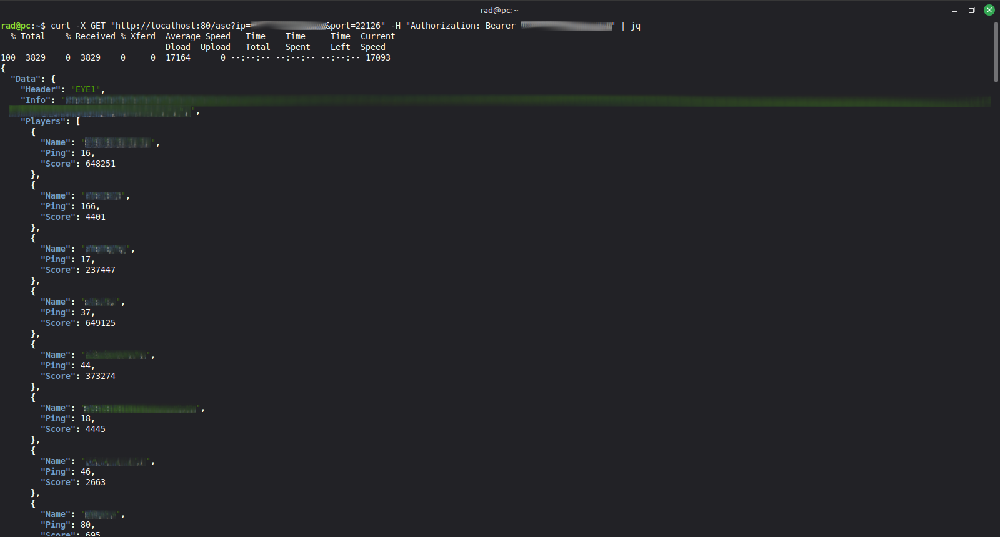

# ASE-to-HTTP-API

ASE (All-Seeing Eye) protocol to HTTP.



## How to Install
1. Rename the `.env-example` file to `.env`.
2. Set `TOKEN` in `.env` to an alphanumeric string of **more than 16 characters**.
3. Change the `PORT` in `.env` if needed.
4. Deploy using Docker Compose:
   ```bash
   docker-compose up -d --build
   ```
   > **Note:** 
   >
   > If you forget to set the `TOKEN`, the program will refuse to run.

## How to Use
Make an HTTP call to `/ase` with:
- Query parameters: `ip` and `port`
- Header: `"Authorization"` containing `"Bearer " + <TOKEN>`

**Example:**
```bash
curl -X GET "http://localhost:8160/ase?ip=<SERVER_IP>&port=<SERVER_PORT>" -H "Authorization: Bearer <TOKEN>"
```

> **Reminder:**
>
> The ASE port is usually the main port **+ 123**.
>
> For example, if the main port is **22003**, the ASE port is typically **22126**.
